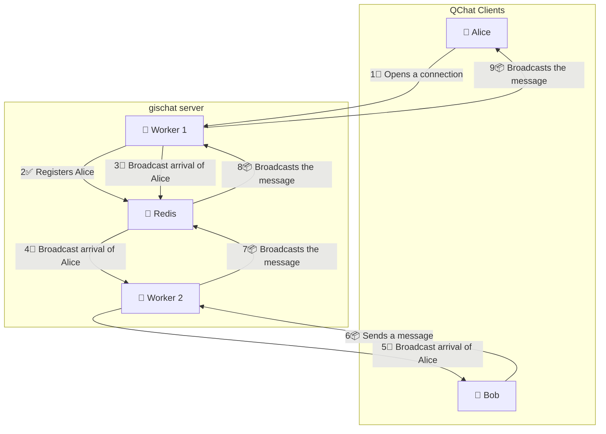

# El rediseño de QChat

{: .img-thumbnail-left }

After [a somewhat shaky first version](./2024-10-18_introducing-QChat-chat-rooms-in-QGIS.md), Geotribu is pleased to announce some fairly significant and impactful changes to QChat, the chat system integrated into QGIS.

The new version of QChat is a bit like when [Com Truise](https://www.youtube.com/watch?v=L4ENAdECytk) gets on a motorbike: it really gets the blood pumping!

{: .img-center loading=lazy }

<!-- more -->

_A photo shamelessly stolen from Mastodon... If you know the author, please contact us!_

## Why?

The first version of QChat was quite rudimentary and not very scalable. In practical terms, due to its rather limited initial design, the API could only run on a single [uvicorn worker](https://fastapi.tiangolo.com/deployment/server-workers/), i.e. a single system process. This could lead to a limit on the number of people connected simultaneously.

We realised this [during the last QGIS-fr Users Meetings in Avignon](https://video.osgeo.org/w/cabBYiLUoRAZZbLp2CTRj7), and during [the quizz](https://slides.geotribu.net/2025-06-11_qchat_qgisfr2025.html#/0/24) in particular :cold_sweat:

_Patatra_...

With more than 100 people connected, things started to get a bit hectic... :boom::dash:

In order to be able to accommodate more people, we needed to review the design and implementation of the API.

Note that the new version brings some additional features, but the redesign is mainly _under the hood_.

## API redesign: `gischat`

The problem with the initial design is that, on the server side, users and their websocket connections are stored in Python lists and dictionaries. This has the advantage of keeping things simple — which was kind of the initial idea behind QChat :kissing_heart:.

But when you start working with multiple parallel workers, it becomes a problem, because workers are separate processes, each with their own Python lists and dictionaries. For example, it is impossible to insert an element from one worker and retrieve it from another.

It therefore becomes inevitable to use a "database" system or equivalent in order to store common information and enable communication between the different workers. It's difficult to do without it.

With a view to keeping things [K.I.S.S.](https://en.wikipedia.org/wiki/KISS_principle) :kiss:, we turned to [redis](https://redis.io/), which can run on our server and offers a very lightweight ‘database’: lists, dictionaries, etc. Exactly what we need to keep QChat from becoming overly complex.

In addition, Redis offers a [publish](https://redis.io/docs/latest/commands/publish/) & [subscribe](https://redis.io/docs/latest/commands/subscribe/) mechanism, which will allow our various parallel workers to communicate with each other in order to notify a QChat channel.

Here is a diagram explaining how the new QChat server works, which remains the same regardless of the number of parallel workers:

!!! info
    The "default" Geotribu server is located at `qchat.geotribu.net`, and offers one channel per language/country: `QGIS-fr`, `QGIS-es`, `QGIS-de`, `QGIS-it`... It is also possible to set up your own server [by following the instructions on the `gischat` repository](https://github.com/geotribu/gischat#deploy-a-self-hosted-instance).

## Creation of the official QGIS plugin: `QChat`

The initial version of QChat in QGIS was part of a hidden feature of the [QTribu](https://plugins.qgis.org/plugins/qtribu/) plugin. It wasn't very easy to find or discover.

So here is a new dedicated plugin available on the official repository: [QChat](https://plugins.qgis.org/plugins/qchat/).

To generate it, [the QGIS plugin templater](https://oslandia.gitlab.io/qgis/template-qgis-plugin/) was used. Unlike the [~~Plugin Builder~~](https://plugins.qgis.org/plugins/pluginbuilder/), this templater has the advantage of creating a solid and modern QGIS plugin structure:

- a clean file tree.
- customizable settings for the plugin, directly in the general QGIS settings.
- a documentation skeleton that is easy to develop.
- a [CICD](https://en.wikipedia.org/wiki/CI/CD) that allows you to publish your plugin automatically and according to your preferred Git platform (GitHub or GitLab are available).

We ran the templater, and 24 prompts later we ended up with a solid QGIS plugin structure!

Here is the output of the plugin generation operation. What's more, it lets you know if you need to see an ophthalmologist at the start of the new school year...

{: .img-center loading=lazy }

!!! warning
    If you want to create a new QGIS plugin in the future, forget the Plugin Builder. It's way more fancy to start with the templater.

## Bonus: a QField plugin for QChat

Alongside the development of the API and the QChat plugin, there is now also [a QField plugin](https://github.com/geotribu/qchat-qfield-plugin) compatible with QChat, for which we would like to thank [Mathieu Pellerin](https://github.com/nirvn), who initiated the project and got us started.

{: .img-center loading=lazy }

Currently, to use it, you need to add this URL in the "Plugins" settings of QField: <https://github.com/geotribu/qchat-qfield-plugin/releases/latest/download/qfield-plugin-qchat.zip>

In the future, we will do our best to make it available on the QField plugin repository once it is up and running :wink:

## What's next?

There is now a single instance served by Geotribu: [`qchat.geotribu.net`](https://qchat.geotribu.net). On it, you can find channels by language.

And there are always new ideas and features to develop in QChat. Here are some of the ones we're thinking about:

- Adding a small form for sending emojis :joy_cat:
- Sharing graphic models between multiple clients connected to QChat.
- Sharing and executing pyqgis code. Yes. Just to please your IT Security Manager :smirk:
- Adding a new panel and API feature to communicate with [matrix](https://matrix.org/) servers, a decentralized communication standard.

And a lot more! If you have any ideas, please share them with us!
